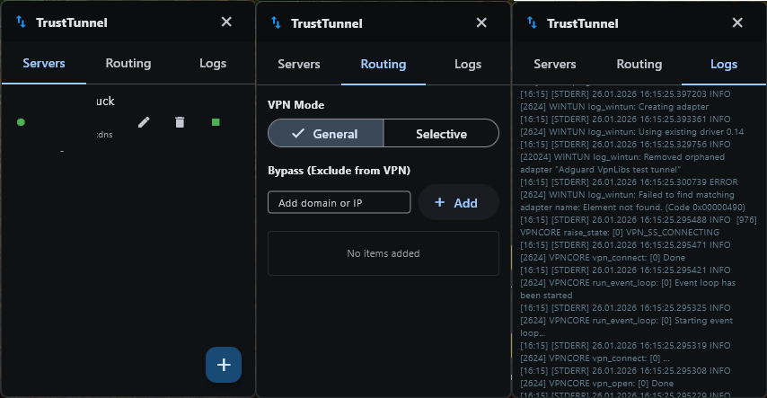

# TrustTunnelRock GUI 🚀

A lightweight and user-friendly graphical interface for the [TrustTunnel CLI VPN client](https://github.com/TrustTunnel/TrustTunnelClient), built with Flutter.

---

## 📥 Download
The latest builds for Windows and Linux are always available in the **Releases** section:

👉 **[Download TrustTunnel GUI](https://github.com/xizerlix/trust_tunnel_rock/releases/latest)**

---

## ✨ Features
* **Cross-platform:** Native support for Windows and Linux.
* **Stealth Mode:** The TrustTunnel core runs in the background without annoying console windows.
* **Real-time Logs:** Watch VPN connection status, errors, and warnings in real-time.
* **Easy Configuration:** Use simple TOML files for VPN server configuration.
* **System Tray:** Minimize to system tray for unobtrusive operation.
* **System Tray:** Manage your connection easily via the system tray icon.

## 🛠 Installation
1. Download the archive for your OS from the Releases page.
2. Extract the files to any folder.
3. Run the executable file.
   * *Note for Windows users:* The application require **Administrator privileges** to create the VPN tunnel.

## 📜 License
This project is licensed under the **MIT License**. See the [LICENSE](LICENSE) file for details.
